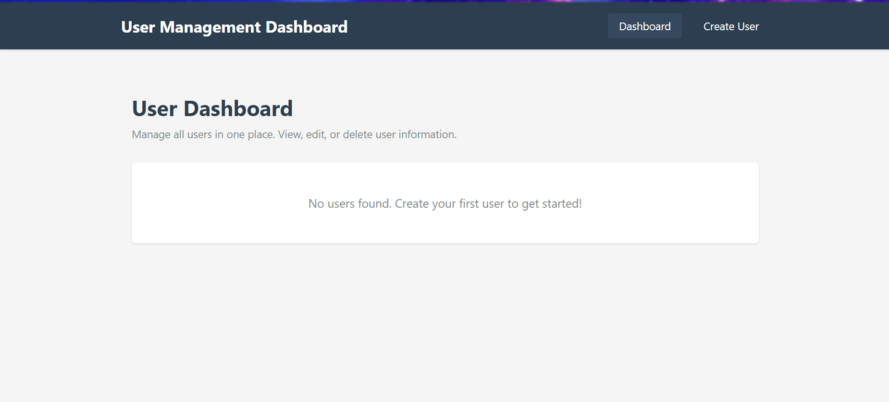
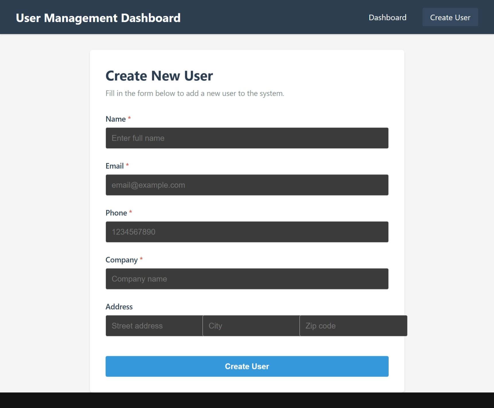
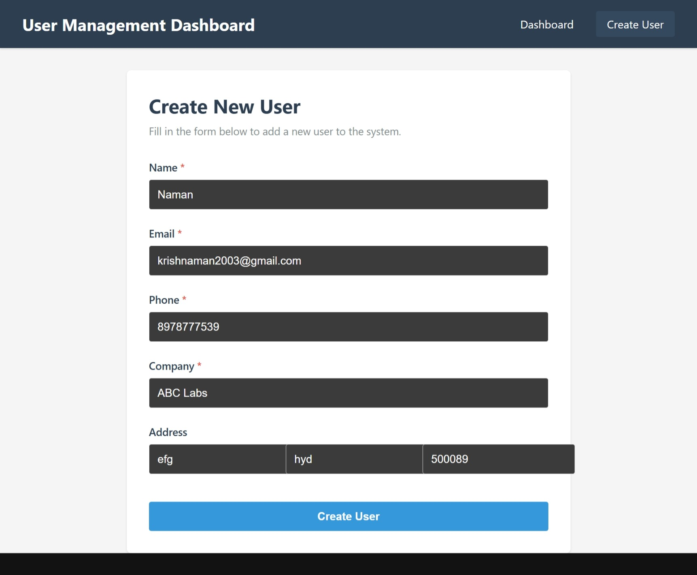
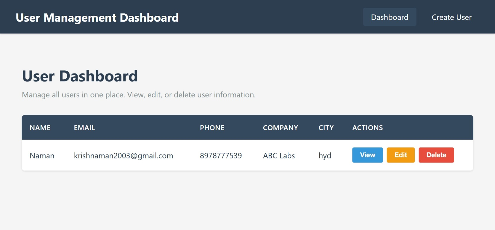

# User-Management-Dashboard

A full-stack user management dashboard. This repository contains a Python FastAPI backend and a React frontend.

## Tech stack
- Backend
  - Python (3.8+)
  - FastAPI
  - Uvicorn (ASGI server)
  - Pydantic (schemas/models)
  - Dependencies listed in `backend/requirements.txt`
- Frontend
  - React (JSX)
  - Plain CSS (see `frontend/src/styles.css`)
  - Node.js + npm
  - Frontend configuration and scripts in `frontend/package.json`
- Development environment
  - Environment variables configured via `backend/.env` (example file included)
  - Runs locally on typical dev ports (backend: 8000, frontend: 3000 or as defined in `package.json`)

## Repo structure (relevant parts)
- `backend/`
  - `.env` — environment variables (sensitive values; don't commit secrets)
  - `requirements.txt` — Python deps
  - `app/`
    - `main.py` — FastAPI app entrypoint
    - `start-uvicorn.ps1` — convenience PowerShell script to start the backend
    - `routers/users.py` — API routes for users
    - `models/`, `schemas/` — data models and pydantic schemas
- `frontend/`
  - `package.json` — frontend scripts and deps
  - `public/` — static HTML
  - `src/` — React app (pages, components, services)

## Quick start (Windows PowerShell)
Prerequisites:
- Python 3.8+
- Node.js (14+) and npm (or yarn)
- Git (optional)

Open two PowerShell windows or tabs (one for backend, one for frontend).

1) Backend (PowerShell)
```powershell
# from project root
cd .\backend\

# create and activate venv (first time)
python -m venv .venv
.\.venv\Scripts\Activate.ps1

# install Python dependencies
pip install -r requirements.txt

# ensure environment variables are set in backend\.env
# then start the backend using the provided script:
.\app\start-uvicorn.ps1

# or start directly with uvicorn (hot-reload):
uvicorn app.main:app --reload --host 127.0.0.1 --port 8000
```

2) Frontend (PowerShell)
```powershell
# from project root (in a separate terminal)
cd .\frontend\

# install dependencies
npm install

# start dev server (script name may be "start" or "dev" — check package.json)
npm start
# or
npm run dev
```

3) Open the apps
- Frontend: open the dev server URL (commonly `http://localhost:3000` or Vite `http://localhost:5173`) — check the console output when running `npm start`.
- Backend API docs (FastAPI): `http://127.0.0.1:8000/docs` (Swagger UI) or `http://127.0.0.1:8000/redoc`

## Screenshots

The screenshots used by this README are stored in the repository under the `screenshots/` folder. The images will render on GitHub when referenced with the correct relative paths.

Below is a simple 2x2 gallery (Markdown table) that displays the images side-by-side on GitHub:

| Empty dashboard | Create user (empty) |
| --- | --- |
|   
*Figure 1 — Empty dashboard* |   
*Figure 2 — Create user form (empty)* |

| Create user (filled) | Dashboard with user |
| --- | --- |
|   
*Figure 3 — Create user form (filled)* |   
*Figure 4 — Dashboard with a user listed* |

If you prefer, here are the same images one-by-one in plain Markdown:

  
*Figure 1 — Empty dashboard*

  
*Figure 2 — Create user form (empty)*

  
*Figure 3 — Create user form (filled)*

  
*Figure 4 — Dashboard with a user listed*

Notes:
- The relative paths (screenshots/...) will work as long as the images are committed to the repository at the same path as the README. If your README is in a different branch, ensure the images exist on that branch.
- If you want to use absolute URLs (for example to show images from a specific branch), use raw GitHub URLs like:
  https://raw.githubusercontent.com/krishnaman2003/User-Management-Dashboard/main/screenshots/dashboard-empty.png

## Environment variables
Edit `backend/.env` before running the backend. Typical values you might see or want to set:
```
# backend/.env (example)
DATABASE_URL=sqlite:///./dev.db
SECRET_KEY=replace-this-with-a-secure-random-string
ENV=development
PORT=8000
```
(If your project uses a different DB or credentials, set `DATABASE_URL` accordingly. Do not commit real secrets.)

## Build / Production (summary)
- Frontend: build static assets:
```powershell
cd .\frontend\
npm run build
```
- Backend: run `uvicorn app.main:app --host 0.0.0.0 --port 8000 --workers 4` behind a production reverse proxy, or use an ASGI server + process manager suitable for production.

## Where to look / edit
- Backend routes: `backend/app/routers/users.py`
- Backend entrypoint: `backend/app/main.py`
- Frontend pages/components: `frontend/src/pages/`, `frontend/src/components/`
- Frontend API calls: `frontend/src/services/api.jsx`

## Troubleshooting
- If `uvicorn` not found: ensure virtualenv is activated and `pip install -r requirements.txt` completed.
- Port conflicts: change ports via env vars or command flags (`--port`).
- Frontend dev server port may vary (3000 vs 5173). Check `frontend/package.json` scripts or the console output after `npm start`.
